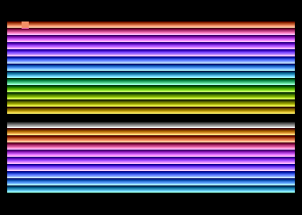

# Draw 128 colors to GR0 screen and rotate them

Inspired by <https://playermissile.com/dli_tutorial/index.html#marching-rainbow-text>

Follow the main [README](../README.md) to assemble/run/debug.

