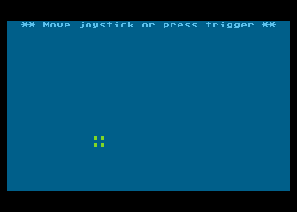

### Using of joystick in player/missile graphics
Follow main [README](../README.md)

#### Known issue

Let's have set `Left Ctrl` as a joystick trigger and the `Left`, `Right`, `Up`, `Down` arrows for joystick moving in emulator.

Now if you **press and hold** `Left Ctrl` and concurrently **press** `Left Arrow` + `Down Arrow` or `Right Arrow` + `Down Arrow`, then a player move is done only down and not to the left or right on some keyboards. Also sometimes a trigger is suddenly released itself when having pressed such combination of keys.

Tested with the keyboards
* Dell KM5221W - affected
* Genius LuxePad 9100 and keyboard on NTB Lenovo Yoga Slim 7 14ARE05 - not affected
